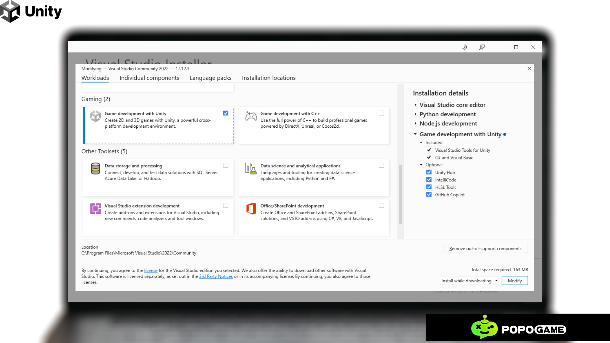

# How to Connect Visual Studio and Unity

In this quick guide, you'll learn how to install and set up the Visual Studio Tools for Unity extension, enabling you to develop cross-platform games and applications using Unity. This free extension enhances your workflow with features for writing and debugging C# scripts and more. For a detailed breakdown of what the Unity workload includes, check out the Tools for Unity overview.

# 1. Install Visual Studio with Unity Support

- **Download Visual Studio** from the official website.

- During installation:
  - Select the **Game development with Unity** workload.

- This will install the required Unity tools, including **Visual Studio Tools for Unity.**

# 2. Install Unity and Set Up a Project
  - Download **Unity Hub** and the **Unity Editor** from the Unity +website.

    
- Create a new Unity project or open an existing one.

# 3. Set Visual Studio as the Default Script Editor

- Open Unity and go to:
  - **Edit > Preferences > External Tools** (Windows)
  - **Unity > Preferences > External Tools** (macOS)

- Under **External Script Editor**, select **Visual Studio** from the dropdown list.

# 4. Open a Script in Visual Studio

- In Unity, double-click any C# script in the **Project window.**

  

- Unity will open the script in Visual Studio, generating the necessary project files (e.g., .csproj).

# 5. Enable Debugging

- To debug your game:
  1. In Visual Studio, go to **Debug > Attach To Process.**
 
  
  
  2. Select the Unity process from the list of running instances.
 
  

  3. Place breakpoints in your code to inspect variables or pause execution when those lines are reached.
 
  # 6. Install or update the Visual Studio Editor package

  - In the Unity Editor, select the Windows > Package Manager.
    

- Select the Visual Studio Editor package.
- If a new version is available, select Update.

# 7. Check for updates

We recommend that you keep Visual Studio and Visual Studio for Mac updated for the latest bug fixes, features, and Unity support. Updating Visual Studio doesn't require an update of Unity versions.
1. Select the Help > Check for Updates menu.

2. If an update is available, the Visual Studio Installer shows a new version. Select Update

